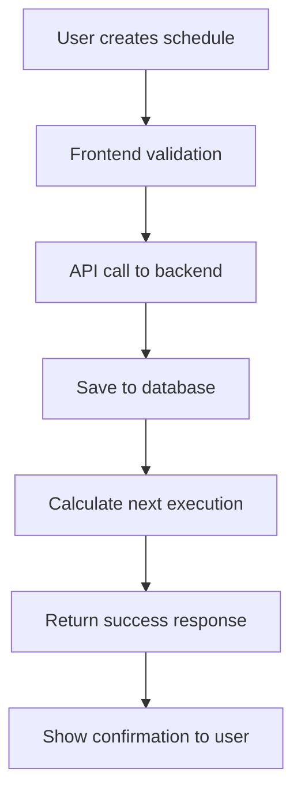
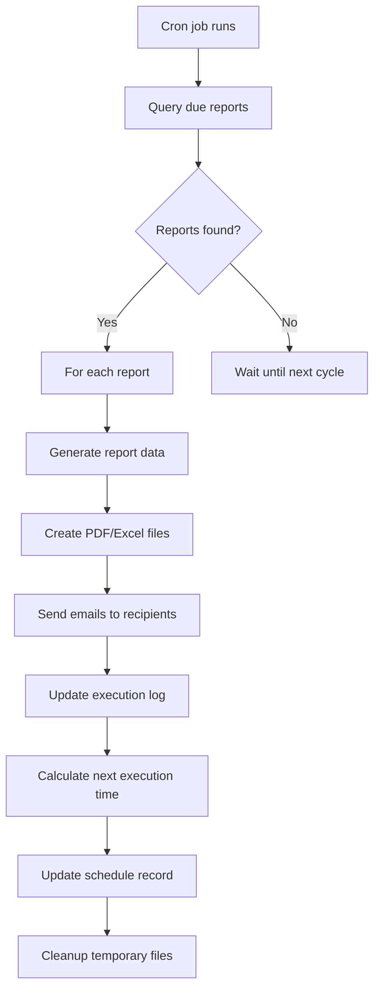

# Schedule Report Execution Strategy
## Automated Dashboard Reporting System

## 📋 Overview
The schedule report feature allows PBNU organizations to set up automated email reports for dashboard data. This document outlines the complete execution strategy from user interface to backend automation.

---

## 🎯 User Experience Flow

### 1. **Schedule Creation**
- User clicks "Schedule Reports" in Share modal
- Schedule modal opens with comprehensive options:
  - Report type selection (Overview, Activation, Statistics, etc.)
  - Frequency (Daily, Weekly, Monthly)
  - Time and date configuration
  - Email recipients management
  - Format options (PDF, Excel)
  - Advanced settings (filters, custom messages)

### 2. **Configuration Options**
- **Report Types**: Overview, Activation, Statistics, Trends, Complete Report
- **Frequencies**: Daily at specific time, Weekly on chosen day, Monthly on specific date
- **Recipients**: Multiple email addresses with validation
- **Formats**: PDF with charts, Excel with data
- **Filters**: Option to include current dashboard filters

### 3. **Validation & Preview**
- Real-time form validation
- Schedule summary preview
- Next report date calculation
- Email recipient verification

---

## 🛠️ Technical Implementation

### Frontend Components

#### 1. **DashboardScheduleModal.vue**
```typescript
interface ScheduleForm {
  reportType: 'overview' | 'activation' | 'statistics' | 'trends' | 'complete'
  frequency: 'daily' | 'weekly' | 'monthly'
  dayOfWeek: number    // 0-6 (Sunday-Saturday)
  dayOfMonth: number   // 1-31 or 'last'
  time: string         // HH:MM format
  recipients: string[] // Email addresses
  formats: ('pdf' | 'excel')[]
  includeCurrentFilters: boolean
  customMessage: string
}
```

#### 2. **API Integration**
```typescript
// Create schedule
POST /api/dashboard/schedule-report
{
  reportType: 'overview',
  frequency: 'weekly',
  schedule: { dayOfWeek: 1, time: '09:00' },
  recipients: ['admin@pbnu.org', 'manager@pbnu.org'],
  formats: ['pdf', 'excel'],
  filters: { wilayah: 'Pusat', tingkat: 'Pengurus' },
  customMessage: 'Weekly dashboard report for PBNU management.'
}

// List schedules
GET /api/dashboard/schedules

// Update schedule
PUT /api/dashboard/schedules/:id

// Delete schedule
DELETE /api/dashboard/schedules/:id
```

---

## ⚙️ Backend Architecture

### 1. **Database Schema**

#### **scheduled_reports** table
```sql
CREATE TABLE scheduled_reports (
    id UUID PRIMARY KEY DEFAULT gen_random_uuid(),
    user_id INTEGER NOT NULL,
    management_id INTEGER,
    name VARCHAR(255) NOT NULL,
    report_type VARCHAR(50) NOT NULL,
    frequency VARCHAR(20) NOT NULL, -- 'daily', 'weekly', 'monthly'
    schedule_config JSONB NOT NULL, -- { dayOfWeek: 1, time: '09:00', dayOfMonth: 15 }
    recipients JSONB NOT NULL, -- ['email1@example.com', 'email2@example.com']
    formats JSONB NOT NULL, -- ['pdf', 'excel']
    filters JSONB, -- Dashboard filters to apply
    custom_message TEXT,
    is_active BOOLEAN DEFAULT true,
    last_execution TIMESTAMP,
    next_execution TIMESTAMP,
    created_at TIMESTAMP DEFAULT CURRENT_TIMESTAMP,
    updated_at TIMESTAMP DEFAULT CURRENT_TIMESTAMP
);

-- Indexes for performance
CREATE INDEX idx_scheduled_reports_next_execution ON scheduled_reports(next_execution, is_active);
CREATE INDEX idx_scheduled_reports_user_management ON scheduled_reports(user_id, management_id);
```

#### **report_executions** table
```sql
CREATE TABLE report_executions (
    id UUID PRIMARY KEY DEFAULT gen_random_uuid(),
    scheduled_report_id UUID NOT NULL REFERENCES scheduled_reports(id),
    execution_time TIMESTAMP NOT NULL,
    status VARCHAR(20) NOT NULL, -- 'success', 'failed', 'partial'
    recipients_sent INTEGER DEFAULT 0,
    recipients_failed INTEGER DEFAULT 0,
    file_paths JSONB, -- Generated file locations
    error_message TEXT,
    execution_duration INTEGER, -- in milliseconds
    created_at TIMESTAMP DEFAULT CURRENT_TIMESTAMP
);

CREATE INDEX idx_report_executions_schedule_time ON report_executions(scheduled_report_id, execution_time);
```

### 2. **Cron Job Architecture**

#### **Option A: Database-Driven Cron (Recommended)**
```typescript
// Background service that runs every minute
class ReportScheduler {
  async processScheduledReports() {
    // Find reports due for execution
    const dueReports = await db.query(`
      SELECT * FROM scheduled_reports 
      WHERE is_active = true 
        AND next_execution <= NOW()
      ORDER BY next_execution
    `);

    for (const report of dueReports) {
      await this.executeReport(report);
    }
  }

  async executeReport(schedule: ScheduledReport) {
    const executionId = uuid();
    
    try {
      // 1. Generate report data
      const reportData = await this.generateReportData(
        schedule.report_type, 
        schedule.filters
      );

      // 2. Generate files
      const files = await this.generateReportFiles(
        reportData, 
        schedule.formats
      );

      // 3. Send emails
      const emailResults = await this.sendReportEmails(
        schedule.recipients,
        files,
        schedule.custom_message
      );

      // 4. Update next execution time
      const nextExecution = this.calculateNextExecution(schedule);
      await this.updateSchedule(schedule.id, { 
        last_execution: new Date(),
        next_execution: nextExecution 
      });

      // 5. Log successful execution
      await this.logExecution(executionId, schedule.id, 'success', emailResults);

    } catch (error) {
      await this.logExecution(executionId, schedule.id, 'failed', null, error.message);
    }
  }
}
```

#### **Option B: System Cron Integration**
```bash
# /etc/crontab or cron.d/dashboard-reports
# Check every minute for due reports
* * * * * /usr/bin/node /app/scripts/process-scheduled-reports.js

# Daily cleanup of old execution logs (optional)
0 2 * * * /usr/bin/node /app/scripts/cleanup-report-logs.js
```

### 3. **Report Generation Service**

```typescript
class ReportGenerator {
  async generateReportData(reportType: string, filters: any) {
    switch (reportType) {
      case 'overview':
        return await this.getOverviewData(filters);
      case 'activation':
        return await this.getActivationData(filters);
      case 'statistics':
        return await this.getStatisticsData(filters);
      case 'trends':
        return await this.getTrendsData(filters);
      case 'complete':
        return await this.getCompleteReportData(filters);
    }
  }

  async generateReportFiles(data: any, formats: string[]) {
    const files = [];
    const timestamp = new Date().toISOString().split('T')[0];

    if (formats.includes('pdf')) {
      const pdfPath = await this.generatePDF(data, timestamp);
      files.push({ type: 'pdf', path: pdfPath });
    }

    if (formats.includes('excel')) {
      const excelPath = await this.generateExcel(data, timestamp);
      files.push({ type: 'excel', path: excelPath });
    }

    return files;
  }

  async generatePDF(data: any, timestamp: string) {
    // Use library like Puppeteer, jsPDF, or similar
    const pdf = await this.createPDFWithCharts(data);
    const filename = `dashboard-report-${timestamp}.pdf`;
    const filePath = `/tmp/reports/${filename}`;
    
    await fs.writeFile(filePath, pdf);
    return filePath;
  }

  async generateExcel(data: any, timestamp: string) {
    // Use library like ExcelJS
    const workbook = await this.createExcelWorkbook(data);
    const filename = `dashboard-data-${timestamp}.xlsx`;
    const filePath = `/tmp/reports/${filename}`;
    
    await workbook.xlsx.writeFile(filePath);
    return filePath;
  }
}
```

### 4. **Email Service Integration**

```typescript
class EmailService {
  async sendReportEmails(recipients: string[], files: any[], customMessage?: string) {
    const results = {
      sent: 0,
      failed: 0,
      errors: []
    };

    for (const recipient of recipients) {
      try {
        await this.sendEmail({
          to: recipient,
          subject: `Dashboard Persuratan PBNU - ${new Date().toLocaleDateString('id-ID')}`,
          body: this.generateEmailBody(customMessage),
          attachments: files.map(file => ({
            filename: path.basename(file.path),
            path: file.path
          }))
        });
        results.sent++;
      } catch (error) {
        results.failed++;
        results.errors.push({ recipient, error: error.message });
      }
    }

    return results;
  }

  generateEmailBody(customMessage?: string): string {
    return `
      <!DOCTYPE html>
      <html>
        <head>
          <meta charset="utf-8">
          <title>Dashboard Report</title>
        </head>
        <body style="font-family: Arial, sans-serif;">
          <div style="max-width: 600px; margin: 0 auto;">
            <h2 style="color: #257941;">Dashboard Persuratan PBNU</h2>
            <p>Assalamu'alaikum warahmatullahi wabarakatuh,</p>
            
            ${customMessage ? `<p>${customMessage}</p>` : ''}
            
            <p>Terlampir adalah laporan dashboard persuratan PBNU untuk periode ini. 
               Laporan ini berisi informasi terkini mengenai:</p>
            <ul>
              <li>Status aktivasi kepengurusan</li>
              <li>Statistik surat masuk dan keluar</li>
              <li>Log disposisi dan memo</li>
              <li>Trend dan analisis periode</li>
            </ul>
            
            <p>Untuk mengakses dashboard secara langsung, silakan kunjungi: 
               <a href="https://dashboard.persuratan-pbnu.com">Dashboard Persuratan PBNU</a></p>
            
            <p>Wassalamu'alaikum warahmatullahi wabarakatuh</p>
            
            <hr style="margin: 20px 0; border: none; border-top: 1px solid #eee;">
            <p style="font-size: 12px; color: #666;">
              Email ini dikirim secara otomatis oleh sistem Dashboard Persuratan PBNU.<br>
              Generated on ${new Date().toLocaleString('id-ID')}
            </p>
          </div>
        </body>
      </html>
    `;
  }
}
```

---

## 🔄 Execution Workflow

### 1. **Schedule Creation Process**


### 2. **Report Execution Process**


### 3. **Error Handling & Retry**
- **Failed Generation**: Log error, notify admin, retry after 1 hour
- **Failed Email**: Retry individual emails up to 3 times
- **Partial Success**: Log successful/failed recipients separately
- **System Errors**: Alert monitoring system, create incident

---

## 📊 Monitoring & Analytics

### 1. **Execution Metrics**
- Success/failure rates per schedule
- Average execution time
- Email delivery rates
- Popular report types and frequencies

### 2. **User Engagement**
- Number of active schedules per organization
- Most requested report types
- Peak scheduling times
- Recipient engagement (if email tracking enabled)

### 3. **System Health**
- Cron job execution status
- File generation success rates
- Email service availability
- Storage usage for report files

---

## 🔧 Configuration & Management

### 1. **Admin Interface** (Optional)
- View all scheduled reports across organizations
- Monitor execution status and logs
- Pause/resume schedules system-wide
- Export execution analytics

### 2. **User Management**
- View their own scheduled reports
- Edit recipient lists and timing
- Pause/activate individual schedules
- View execution history

### 3. **System Settings**
```typescript
// Configuration options
const REPORT_CONFIG = {
  maxRecipientsPerSchedule: 10,
  maxSchedulesPerUser: 5,
  supportedFormats: ['pdf', 'excel'],
  fileRetentionDays: 30,
  maxRetryAttempts: 3,
  executionTimeoutMs: 300000, // 5 minutes
};
```

---

## 🚀 Deployment Considerations

### 1. **Infrastructure Requirements**
- **Background Worker**: Node.js service or similar for cron processing
- **File Storage**: Temporary storage for generated reports
- **Email Service**: SMTP server or service (SendGrid, SES, etc.)
- **Database**: PostgreSQL with proper indexing
- **Monitoring**: Logging and alerting for failed executions

### 2. **Security**
- Validate all email recipients
- Sanitize custom messages
- Secure file storage and cleanup
- Rate limiting on schedule creation
- Audit logs for all operations

### 3. **Performance**
- Batch process multiple reports
- Optimize database queries with proper indexes
- Use connection pooling for database access
- Implement file cleanup for temporary reports
- Consider email sending limits and throttling

This comprehensive execution strategy ensures reliable, scalable automated reporting for PBNU organizations while maintaining security and performance standards.